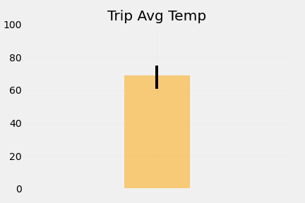

# 10 SQLAlchemy Challenge - Krishna Reddy

## Surfs Up!

In this repo, we present a climate analysis of Honolulu, Hawaii.

## Step 1 - Climate Analysis and Exploration

We use Python and SQLAlchemy to do basic climate analysis and data exploration of the provided climate database. All of the following analysis will be completed using SQLAlchemy ORM queries, Pandas, and Matplotlib.

* The analysis is presented in the [notebook](climate.ipynb). The provided database files to complete the climate analysis and data exploration is [hawaii.sqlite](Resources/hawaii.sqlite).

* To connect to the SQLite database we use SQLAlchemy `create_engine`. We use SQLAlchemy `automap_base()` to reflect the tables into classes and save a reference to those classes called `Station` and `Measurement`.

### Precipitation Analysis

* Design a query to retrieve the last 12 months of precipitation data and select only the `date` and `prcp` values. Load the query results into a Pandas DataFrame and set the index to the date column. Sort the DataFrame values by `date` and plot the results. Use Pandas to print the summary statistics for the precipitation data.

  

### Station Analysis

* Design a query to calculate the total number of stations and find the most active stations. List the stations and observation counts in descending order and find which station has the highest number of observations? 

* Design a query to retrieve the last 12 months of temperature observation data (TOBS). Filter by the station with the highest number of observations and plot the results as a histogram.

    

- - -

## Step 2 - Climate App

Design a Flask API based on the queries that you have just developed.

### Flask Routes:

* `/`

  * Home page.

  * List all routes that are available.

* `/api/v1.0/precipitation`

  * Convert the query results to a dictionary using `date` as the key and `prcp` as the value.

  * Return the JSON representation of your dictionary.

* `/api/v1.0/stations`

  * Return a JSON list of stations from the dataset.

* `/api/v1.0/tobs`
  * Query the dates and temperature observations of the most active station for the last year of data.
  
  * Return a JSON list of temperature observations (TOBS) for the previous year.

* `/api/v1.0/<start>` and `/api/v1.0/<start>/<end>`

  * Return a JSON list of the minimum temperature, the average temperature, and the max temperature for a given start or start-end range.

  * When given the start only, calculate `TMIN`, `TAVG`, and `TMAX` for all dates greater than and equal to the start date.

  * When given the start and the end date, calculate the `TMIN`, `TAVG`, and `TMAX` for dates between the start and end date inclusive.

- - -

## Additional Analyses

### Temperature Analysis I

* Choose a start date and end date for the trip (make sure that the vacation range is approximately 3-15 days total).

* The notebook contains a function called `calc_temps` that will accept a start date and end date in the format `%Y-%m-%d`. The function will return the minimum, average, and maximum temperatures for that range of dates.

* Using the `calc_temps` function, calculate the min, avg, and max temperatures for the vacation trip using the matching dates from the previous year (i.e., use "2017-01-01" if your trip start date was "2018-01-01").

* Plot the min, avg, and max temperature from your previous query as a bar chart. Use the average temperature as the bar height. and the peak-to-peak (TMAX-TMIN) value as the y error bar (YERR).

    

### Temperature Analysis II

* Calculate the daily normals. Normals are the averages for the min, avg, and max temperatures. The function called `daily_normals` calculates the daily normals for a specific date. This date string will be in the format `%m-%d`.

* Create a list of dates for the trip in the format `%m-%d`. Use the `daily_normals` function to calculate the normals for each date string and append the results to a list. Use Pandas to plot an area plot for the daily normals.

  